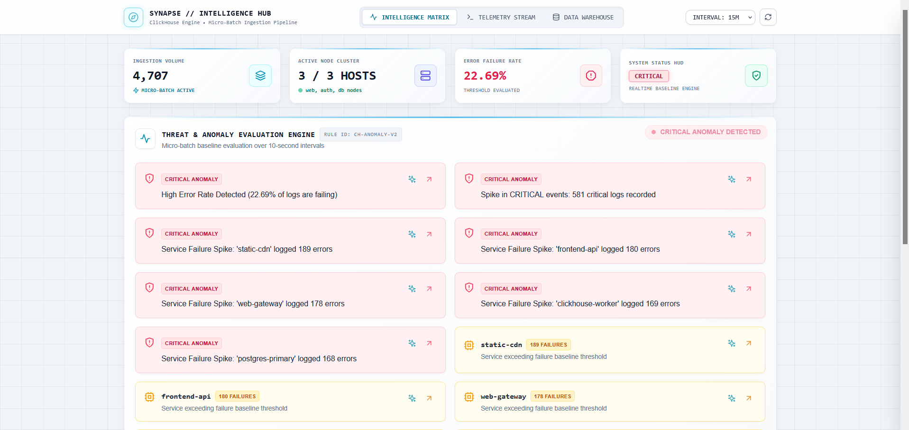
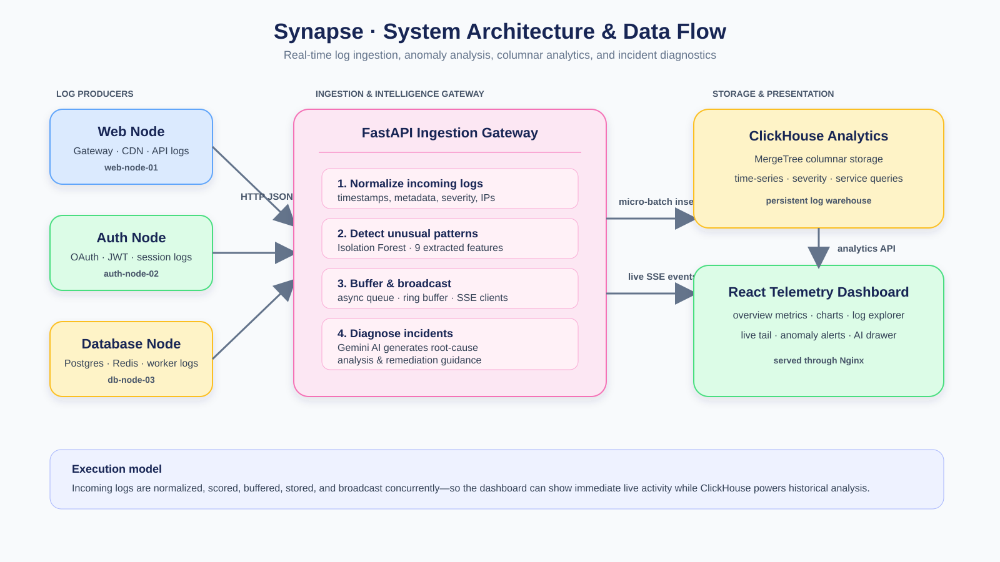
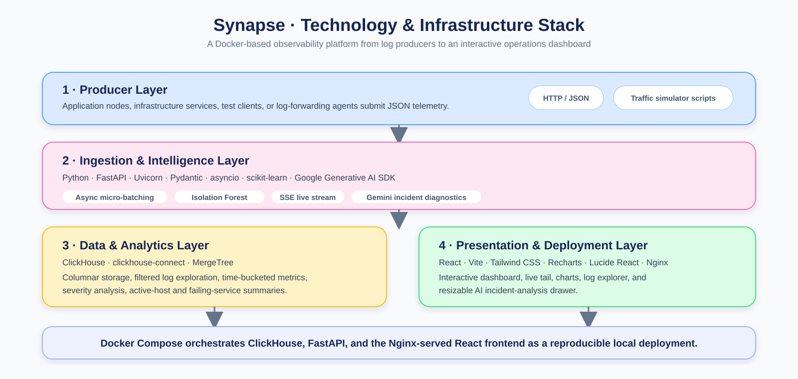
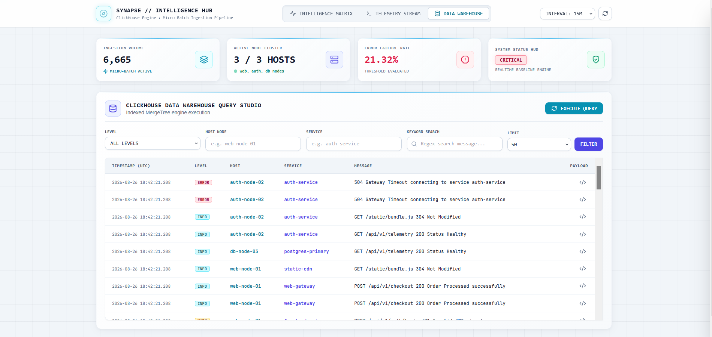
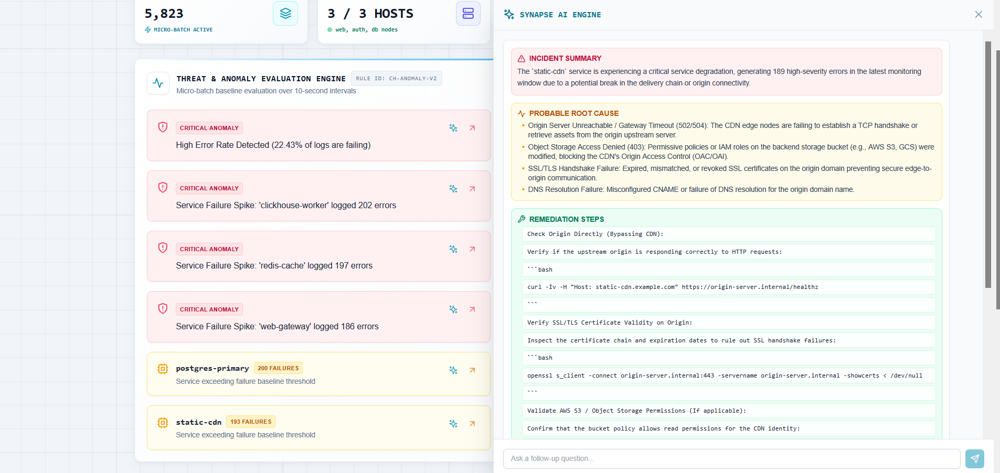

# Synapse

### Real-Time Log Intelligence & Incident Diagnostics Platform

<p align="center">
  Centralized log ingestion · ClickHouse analytics · real-time SSE telemetry · anomaly detection · AI-assisted incident diagnostics
</p>

<p align="center">
  
  
  
  
  
  
</p>

---

## Table of Contents

- [Overview](#overview)
- [System Architecture](#system-architecture)
- [Data Flow Pipeline](#data-flow-pipeline)
- [Key Innovations & Technical Capabilities](#key-innovations--technical-capabilities)
- [Tech Stack & Infrastructure](#tech-stack--infrastructure)
- [Database Schema & Log Explorer](#database-schema--log-explorer)
- [ML Anomaly Detection](#ml-anomaly-detection)
- [Synapse AI — LLM Diagnostic Engine](#synapse-ai--llm-diagnostic-engine)
- [API Endpoints Reference](#api-endpoints-reference)
- [Performance Metrics](#performance-metrics)
- [Deployment](#deployment)
- [Verification & Test Scripts](#verification--test-scripts)
- [Author](#author)

---

## Overview

**Synapse** is a containerized log intelligence platform that ingests, stores, analyzes, and streams infrastructure telemetry in real time.

The platform accepts structured logs through a FastAPI ingestion API, evaluates unusual patterns using an Isolation Forest model, stores records in ClickHouse for historical analysis, and streams live telemetry to a React dashboard through Server-Sent Events (SSE). An integrated Gemini-powered diagnostic assistant helps users investigate service failures and generate remediation guidance.

<p align="center">
  
</p>

---

## System Architecture

<p align="center">
  
</p>

Synapse separates log production, ingestion and intelligence, persistent analytics, and dashboard presentation into distinct but connected layers.

---

## Data Flow Pipeline

1. **Ingest** — producers submit individual log records or JSON arrays to `POST /api/v1/logs`.
2. **Normalize** — FastAPI standardizes timestamps, severity, service, host, IP address, and metadata fields.
3. **Analyze** — the anomaly-detection pipeline extracts nine features and evaluates incoming records with Isolation Forest when the model is available.
4. **Buffer** — normalized records enter an asynchronous queue for micro-batch processing and an in-memory ring buffer for immediate retrieval.
5. **Persist** — the background worker inserts queued logs into ClickHouse in batches every 250 ms or when the queue reaches 500 records.
6. **Stream** — the backend broadcasts recent and newly ingested events to connected dashboard clients through SSE.
7. **Investigate** — dashboard users can filter stored records, monitor failure trends, and send alert context to Synapse AI for incident diagnostics.

---

## Key Innovations & Technical Capabilities

- **Asynchronous micro-batch ingestion** using `asyncio.Queue` to decouple log acceptance from ClickHouse writes.
- **Real-time SSE telemetry** for continuously updated dashboard events without client-side polling.
- **ClickHouse-backed analytics** for time-series aggregation, severity distribution, active-host analysis, service-failure detection, and filtered log exploration.
- **Inline anomaly detection** using an Isolation Forest model and a nine-feature log representation.
- **AI-assisted diagnostics** that converts selected failure context into an incident summary, likely causes, and actionable remediation steps.
- **In-memory recent-log buffer** that supports live telemetry and limited fallback exploration while ClickHouse is unavailable.
- **Containerized local deployment** using Docker Compose for the database, backend, and frontend services.

---

## Tech Stack & Infrastructure

<p align="center">
  
</p>

| Layer               | Technologies                                      |
| ------------------- | ------------------------------------------------- |
| Backend             | Python, FastAPI, Uvicorn, Pydantic, asyncio       |
| Data & Analytics    | ClickHouse, MergeTree, `clickhouse-connect`       |
| Real-Time Streaming | Server-Sent Events, async queue, ring buffer      |
| Machine Learning    | scikit-learn, Isolation Forest, Joblib            |
| AI Diagnostics      | Google Generative AI SDK, Gemini                  |
| Frontend            | React, Vite, Tailwind CSS, Recharts, Lucide React |
| Infrastructure      | Docker, Docker Compose, Nginx                     |

---

## Database Schema & Log Explorer

Logs are stored in ClickHouse using a MergeTree table optimized for filtering by log severity, service, and timestamp.

```sql
CREATE DATABASE IF NOT EXISTS log_analytics;

CREATE TABLE IF NOT EXISTS log_analytics.logs (
    timestamp DateTime64(3, 'UTC') DEFAULT now64(3),
    host LowCardinality(String),
    service LowCardinality(String),
    level LowCardinality(String),
    message String,
    metadata String,
    ip String
)
ENGINE = MergeTree()
ORDER BY (level, service, timestamp)
SETTINGS index_granularity = 8192;
```

The dashboard provides a ClickHouse-backed Log Explorer with filters for severity, host, service, keyword search, and result limit.

<p align="center">
  
</p>

---

## ML Anomaly Detection

Synapse evaluates incoming logs with an inline **Isolation Forest** model before they are persisted and streamed.

Each record is converted into a nine-feature vector:

| Feature                 | Description                                                            |
| ----------------------- | ---------------------------------------------------------------------- |
| Message length          | Character count of the raw log text                                    |
| Severity weight         | Numeric weight derived from detected severity                          |
| Payload size            | Approximate message payload length                                     |
| Digit count             | Number of numeric characters                                           |
| Special-character count | Number of non-alphanumeric symbols                                     |
| Token count             | Number of whitespace-separated tokens                                  |
| IP count                | IPv4-address matches detected by regex                                 |
| Hex count               | Hexadecimal or pointer-like values detected by regex                   |
| Error keyword count     | Matches for terms such as `error`, `timeout`, `exception`, and `fatal` |

A prediction of `-1` marks the record as anomalous and allows the backend to emit an anomaly-specific live event.

---

## Synapse AI — LLM Diagnostic Engine

Synapse AI is an integrated incident-analysis assistant powered by Gemini. Users can submit an alert or service-failure context from the dashboard and receive structured operational guidance.

The assistant produces:

- **Incident Summary** — concise explanation of the detected failure pattern.
- **Probable Root Cause** — likely internal or environmental causes.
- **Remediation Steps** — practical actions, including suggested Bash or SQL commands where appropriate.
- **Context-aware follow-ups** — preserves conversation history for additional investigation.

<p align="center">
  
</p>

> Set `GEMINI_API_KEY` in `.env` to enable AI diagnostics. The core ingestion, analytics, and dashboard features remain separate from this optional integration.

---

## API Endpoints Reference

| Endpoint                     | Method | Description                                                          |
| ---------------------------- | ------ | -------------------------------------------------------------------- |
| `/api/v1/logs`               | `POST` | Ingest one log object or an array of log objects.                    |
| `/api/v1/logs/live-tail`     | `GET`  | Stream recent and live telemetry through SSE.                        |
| `/api/v1/analytics/overview` | `GET`  | Return overview metrics for `15m`, `1h`, `6h`, or `24h`.             |
| `/api/v1/logs`               | `GET`  | Query stored logs by level, service, host, keyword, and limit.       |
| `/api/v1/anomalies`          | `POST` | Broadcast an externally detected anomaly to SSE clients.             |
| `/api/v1/ai/chat`            | `POST` | Generate AI-assisted incident diagnostics.                           |
| `/health`                    | `GET`  | Return backend, database, queue, ring-buffer, and SSE-client status. |

### Example ingestion request

```json
{
  "timestamp": "2026-08-26T18:42:21Z",
  "host": "auth-node-02",
  "service": "auth-service",
  "level": "ERROR",
  "message": "504 Gateway Timeout connecting to service auth-service",
  "metadata": {
    "http_status": 504
  },
  "ip": "192.168.1.25"
}
```

---

## Performance Metrics

| Metric                            | Benchmark coverage              |
| --------------------------------- | ------------------------------- |
| Ingestion Endpoint Latency        | ~3.8 ms per HTTP request        |
| Micro batch flush latency         | 250 ms background cycle         |
| Clickhouse aggregation latency    | ~8.2 ms average execution       |
| Synapse AI response latency       | ~650ms average token generation |
| SSE telemetry delivery latency    | 15 ms end to end                |
| Columnar data compression         | 85% efficiency                  |
| Throughput(50 concurrent workers) | ~1120 req/sec                   |
| Container cold launch time        | ~7 seconds                      |

---

## Deployment

### Prerequisites

- Docker Desktop with Docker Compose
- Gemini API key for the optional AI diagnostic feature
- Python 3.10+ for local simulation and verification scripts

### Configure environment variables

Create a root-level `.env` file:

```dotenv
GEMINI_API_KEY=your_gemini_api_key
```

Never commit your `.env` file or API key.

### Option A — Complete Containerized Deployment (Recommended)

1. Clone the repository and enter the project directory:

   ```bash
   git clone https://www.github.com/Hritshhh/Synapse
   cd Synapse
   ```

2. Build and launch the infrastructure:

   ```bash
   docker compose up --build -d
   ```

3. Verify container health:

   ```bash
   docker compose ps
   ```

   The output should list three running services:
   - `log_analyzer_clickhouse` — ports `8123` and `9000`
   - `log_analyzer_backend` — port `8080`
   - `log_analyzer_frontend` — port `3000`

4. Open the dashboard at [http://localhost:3000](http://localhost:3000).

### Option B — Standalone Local Development

This option is useful when you want to run and debug the backend or frontend independently. The following commands use macOS/Linux or Git Bash syntax.

1. Start ClickHouse through Docker:

   ```bash
   docker run -d --name ch_dev -p 8123:8123 -p 9000:9000 \
     -e CLICKHOUSE_DB=log_analytics \
     -e CLICKHOUSE_USER=analyzer \
     -e CLICKHOUSE_PASSWORD=analyzer_secret \
     -v $(pwd)/init-db:/docker-entrypoint-initdb.d \
     clickhouse/clickhouse-server:latest
   ```

2. Run the FastAPI backend:

   ```bash
   cd backend
   python3 -m venv venv
   source venv/bin/activate
   pip install -r requirements.txt

   DB_HOST=localhost DB_PORT=8123 GEMINI_API_KEY=your_gemini_api_key \
     uvicorn main:app --host 0.0.0.0 --port 8080 --reload
   ```

3. Run the React frontend in a separate terminal:

   ```bash
   cd frontend
   npm install
   npm run dev
   ```

4. Navigate to [http://localhost:3000](http://localhost:3000).

---

## Verification & Test Scripts

### Generate realistic telemetry

```bash
python scripts/simulate_nodes.py
```

Generates baseline log traffic and intermittent failure bursts across simulated web, authentication, and database nodes.

### Benchmark ingestion

```bash
python scripts/benchmark.py
```

Sends 2,000 requests with 50 concurrent workers and reports successful requests, throughput, latency, and process-memory information.

### Test anomaly detection

```bash
python scripts/test_anomalies.py
```

Submits standard and deliberately unusual log payloads to validate the anomaly-detection and live-tail workflow.

---

## Author

Developed by **[Hritaansh Mehra](https://github.com/Hritshhh)**
